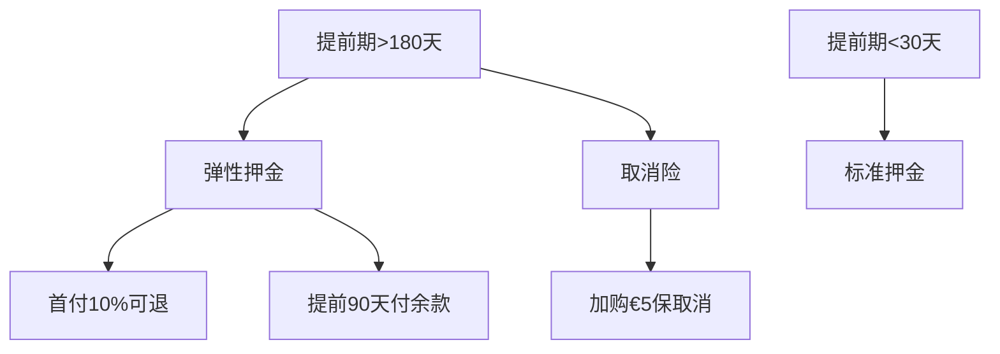

# 《酒店预订取消率分析报告》

## 一、引言
本报告旨在深入分析酒店预订数据，探究影响酒店预订取消率的因素，特别是City Hotel取消率显著高于Resort Hotel的原因，并提出针对性的优化策略和解决方案，构建取消预测模型和动态策略模拟沙盘，以降低取消率，提高酒店收益。

> **项目来源**：
> 本项目中的数据来源于Kaggle开放数据Hotel booking demand
> 数据链接：
> https://www.kaggle.com/datasets/jessemostipak/hotel-booking-demand


## 二、数据理解与数据预处理
### 2.1 数据理解
| 字段                         | 含义                                                                 | 备注                                                                 | 属性       |
|------------------------------|----------------------------------------------------------------------|----------------------------------------------------------------------|------------|
| **hotel**                    | 酒店类型                                                             | H1=度假酒店, H2=城市酒店 (本次分析聚焦City Hotel)                     | 分类       |
| **is_canceled**              | 订单是否取消                                                         | 1=已取消, 0=未取消 (目标变量)                                        | 二进制      |
| **lead_time**                | 预订提前期(天)                                                       | 从下单到入住的天数 (关键预测特征)                                    | 数值       |
| **arrival_date_year**        | 入住年份                                                             |                                                                      | 数值       |
| **arrival_date_month**       | 入住月份                                                             |                                                                      | 分类       |
| **arrival_date_week_number** | 入住周(年内第几周)                                                   |                                                                      | 数值       |
| **arrival_date_day_of_month**| 入住日(月内第几天)                                                   |                                                                      | 数值       |
| **stays_in_weekend_nights**  | 周末入住夜数(周六/日)                                                |                                                                      | 数值       |
| **stays_in_week_nights**     | 工作日入住夜数(周一到五)                                             |                                                                      | 数值       |
| **adults**                   | 成人数量                                                             |                                                                      | 数值       |
| **children**                 | 儿童数量                                                             | 需处理缺失值                                                         | 数值       |
| **babies**                   | 婴儿数量                                                             |                                                                      | 数值       |
| **meal**                     | 餐食类型                                                             | BB=床早, HB=半膳, FB=全膳, SC=无餐                                   | 分类       |
| **country**                  | 客户国籍                                                             | ISO代码 (需处理缺失值为'Unknown')                                    | 分类       |
| **market_segment**           | 市场渠道                                                             | Direct/TA(旅行社)/TO(旅游运营商)/Groups(团体)等                      | 分类       |
| **distribution_channel**     | 分销渠道                                                             | TA/TO/Direct/GDS(全球分销系统)                                       | 分类       |
| **is_repeated_guest**        | 是否回头客                                                           | 1=老客, 0=新客                                                       | 二进制      |
| **previous_cancellations**   | 历史取消次数                                                         | 关键预测特征                                                         | 数值       |
| **previous_bookings_not_canceled**| 历史未取消次数                                                   |                                                                      | 数值       |
| **reserved_room_type**       | 预订房型                                                             | A-L字母编码                                                          | 分类       |
| **assigned_room_type**       | 实际分配房型                                                         | 可能与预订不同                                                       | 分类       |
| **booking_changes**          | 订单修改次数                                                         |                                                                      | 数值       |
| **deposit_type**             | 押金类型                                                             | No Deposit/Non Refund/Refundable (关键预测特征)                      | 分类       |
| **agent**                    | 旅行社ID                                                             |                                                                      | 分类       |
| **company**                  | 公司ID                                                               |                                                                      | 分类       |
| **days_in_waiting_list**     | 等待确认天数                                                         |                                                                      | 数值       |
| **customer_type**            | 客户类型                                                             | Contract(协议)/Group(团体)/Transient(散客)/Transient-party(散客团体) | 分类       |
| **adr**                      | 日均房价(€)                                                          | 总房费/入住夜数 (需过滤负值)                                         | 数值       |
| **required_car_parking_spaces**| 所需停车位数量                                                     |                                                                      | 数值       |
| **total_of_special_requests**| 特殊要求数量                                                         | 如婴儿床/轮椅等                                                      | 数值       |
| **reservation_status**       | 订单状态                                                             | Canceled/Check-Out/No-Show                                           | 分类       |
| **reservation_status_date**  | 状态更新日期                                                         |                                                                      | 日期       |

### 2.1 缺失值处理
| 特征 | 缺失值数量 | 缺失率 | 特征含义 | 缺失原因分析 | 处理方式 |
| --- | --- | --- | --- | --- | --- |
| `company` | 112,593 | 94.3% | 公司ID（企业客户） | 结构性缺失：绝大多数订单来自个人客户 | 创建新特征`is_company_booking`，删除原始列 |
| `agent` | 16,340 | 13.7% | 预订代理ID（旅行社） | 渠道相关缺失：直接预订无代理 | 用0表示直接预订，保留原始ID值，转换为整数类型 |
| `country` | 488 | 0.4% | 客户国籍 | 随机缺失：信息未填写或采集失败 | 填充为'Unknown'并创建新类别 |
| `children` | 4 | <0.01% | 儿童数量 | 随机缺失：输入遗漏 | 视为无儿童，填充0 |

### 2.2 异常值处理
对`adr`（日均房价）、`lead_time`（提前期）、入住人数、入住夜数等关键特征进行异常值处理，确保数据的合理性。同时，对日期逻辑进行检查和修正，确保预订日期早于入住日期。

```python
# 示例代码：adr异常值处理
df = df[(df['adr'] > 0) & (df['adr'] <= 1000)] 
```

## 三、业务指标分析
### 3.1 整体业务概览
| 指标 | 数值 |
| --- | --- |
| 总订单数 | 108501单 |
| 整体取消率 | 38.24% |
| 平均提前期 | 101.0天 |
| 平均每日房价（ADR） | €104.83 |

### 3.2 酒店类型维度对比
| 酒店类型 | 总预订量 | 取消率 | 平均提前期 | 平均房价 |
| --- | --- | --- | --- | --- |
| City Hotel | 72718单 | 42.37% | 102.69天 | €107.70 |
| Resort Hotel | 35783单 | 29.86% | 97.61天 | €98.98 |

从数据可以看出，City Hotel虽然预订量高，但取消率也显著高于Resort Hotel，可能与城市酒店客源结构、需求弹性等有关。

## 四、深入分析影响取消率的因素
### 4.1 押金政策差异
#### 4.1.1 押金类型与取消率关系
| 酒店类型 | 押金类型 | 总预订量 | 取消订单数 | 取消率 | 平均提前期 | 平均房价 |
| --- | --- | --- | --- | --- | --- | --- |
| City Hotel | Non Refund | 11117 | 11094 | 0.9979 | 179.3108 | 96.60615453809488 |
| City Hotel | Refundable | 19 | 14 | 0.7368 | 119.3158 | 116.55526315789474 |
| City Hotel | No Deposit | 61582 | 19702 | 0.3199 | 88.8518 | 109.70357669448306 |
| Resort Hotel | Non Refund | 1583 | 1516 | 0.9577 | 169.3026 | 66.1253758686041 |
| Resort Hotel | No Deposit | 34063 | 9149 | 0.2686 | 94.0491 | 100.62272025364797 |
| Resort Hotel | Refundable | 137 | 21 | 0.1533 | 154.8905 | 71.25861313868613 |

关键发现：
- Non Refund（不可退款）押金取消率极高，但样本量较小。
- No Deposit（无押金）是主流类型，取消率显著低于不可退款类型。
- 不可退款订单平均房价较低，但取消率却很高，可能是因为不可退款政策主要用于高风险订单（如长提前期、旺季）。

#### 4.1.2 押金政策失效的根因分析
Non Refund押金订单的提前期远超平均值，实际入住间隔长，不确定性强，旺季比例显著高于平均值。不可退款政策被用于最高风险订单，客户被迫承担全部风险，反而刺激最后一刻取消。因此，押金政策需与订单风险等级匹配，避免对长提前期订单使用“全损式”不可退款政策。

### 4.2 渠道组合效应
#### 4.2.1 渠道组合与取消率
| 酒店类型 | 市场渠道 | 总预订量 | 取消订单数 | 取消率 | 平均提前期 | 平均房价 |
| --- | --- | --- | --- | --- | --- | --- |
| City Hotel | Groups | 12047 | 8100 | 0.6724 | 159.2362 | 87.85950444094088 |
| City Hotel | Offline TA/TO | 15364 | 6684 | 0.4350 | 127.2907 | 93.63433611039028 |
| City Hotel | Online TA | 37446 | 14404 | 0.3847 | 85.5561 | 119.63733269240646 |
| City Hotel | Aviation | 194 | 45 | 0.2320 | 5.4072 | 103.07051546391753 |
| City Hotel | Corporate | 2675 | 620 | 0.2318 | 28.3656 | 83.95853831775705 |
| City Hotel | Direct | 4963 | 952 | 0.1918 | 62.7435 | 122.77174692726206 |
| Resort Hotel | Groups | 5354 | 2278 | 0.4255 | 152.1263 | 68.25693873739215 |
| Resort Hotel | Online TA | 16647 | 6176 | 0.3710 | 88.0469 | 116.29872649726683 |
| Resort Hotel | Corporate | 1851 | 332 | 0.1794 | 21.7709 | 54.17625607779574 |
| Resort Hotel | Direct | 4767 | 787 | 0.1651 | 64.3314 | 124.69727501573259 |
| Resort Hotel | Offline TA/TO | 7138 | 1111 | 0.1556 | 121.1725 | 76.37535304006764 |

关键发现：
- 高取消率渠道：City Hotel的Groups（67.2%）、Offline TA/TO（43.5%）；Resort Hotel的Groups（42.6%）、Online TA（37.1%）。
- 优质渠道：直接预订（Direct）取消率最低（City 19.2%，Resort 16.5%）；Corporate渠道表现良好（City 23.2%，Resort 17.9%）。
- 渠道分布不均：City Hotel主要依赖Online TA和Groups；Resort Hotel主要依赖Online TA和Offline TA/TO。

#### 4.2.2 渠道经济效益模型
| 酒店类型 | 市场渠道 | 平均房价 | 取消率 | 净房价 | 收益贡献 |
| --- | --- | --- | --- | --- | --- |
| City Hotel | Direct | 122.77 | 0.1918 | 99.27 | 492680.62 |
| City Hotel | Groups | 87.86 | 0.6724 | 28.01 | 337413.94 |

Groups渠道净房价低，取消率高，每单实际收益损失大。将部分Groups订单转向Direct渠道可增收，Groups渠道需重新谈判条款。

### 4.3 提前期效应
#### 4.3.1 提前期分段分析
| 酒店类型 | 提前期分组 | 总预订量 | 取消订单数 | 取消率 | 平均房价 |
| --- | --- | --- | --- | --- | --- |
| City Hotel | <1周 | 6593 | 888 | 0.1347 | 109.35622326710168 |
| City Hotel | 1 - 4周 | 13128 | 3983 | 0.3034 | 114.72123248019433 |
| City Hotel | 3 - 6月 | 11800 | 4597 | 0.3896 | 107.21646440678039 |
| City Hotel | >6月 | 41197 | 21342 | 0.5180 | 105.34142364735214 |
| Resort Hotel | <1周 | 4942 | 362 | 0.0732 | 81.24348037231896 |
| Resort Hotel | 1 - 4周 | 6819 | 1431 | 0.2099 | 98.1690057193138 |
| Resort Hotel | 3 - 6月 | 5009 | 1561 | 0.3116 | 107.11763425833476 |
| Resort Hotel | >6月 | 19013 | 7332 | 0.3856 | 101.74505128070292 |

关键发现：
- 提前期与取消率正相关，超过3个月提前期取消率显著上升。
- City Hotel >6月订单占比达38%。
- 长提前期订单平均房价反而略低。

#### 4.3.2 行动建议
针对>3月提前期订单，提供“提前60天免费改期”权益，采用阶梯式预付款；开发“早鸟优惠”套餐。

### 4.4 价格敏感度
#### 4.4.1 客户类型与价格敏感度
| 酒店类型 | 客户类型 | 总预订量 | 取消订单数 | 取消率 | 平均房价 | 价格敏感度 |
| --- | --- | --- | --- | --- | --- | --- |
| City Hotel | Contract | 2123 | 1041 | 0.4903 | 94.1788553933111 | 0.8888001518705324 |
| City Hotel | Transient | 54468 | 25115 | 0.4611 | 113.04431776455553 | 1.0379199502427423 |
| City Hotel | Transient - Party | 15876 | 4629 | 0.2916 | 91.40614197530955 | 1.0182012276231232 |
| City Hotel | Group | 251 | 25 | 0.0996 | 93.81398406374497 | 0.903114102674254 |
| Resort Hotel | Transient | 26720 | 9096 | 0.3404 | 105.9459532185635 | 0.9629859971960983 |
| Resort Hotel | Transient - Party | 7143 | 1431 | 0.2003 | 78.00150776984432 | 0.8532584629928104 |
| Resort Hotel | Contract | 1718 | 147 | 0.0856 | 79.65173457508722 | 0.9045455850006039 |
| Resort Hotel | Group | 202 | 12 | 0.0594 | 84.49653465346529 | 0.799380872971072 |

关键发现：
- 高取消率客户：City Hotel的Transient（46.1%）、Contract（49.0%）；Resort Hotel的Transient（34.0%）。
- 优质客户：Group类型取消率极低（City 10.0%，Resort 5.9%）。
- Transient客户价格敏感指数最高，支付价格高于渠道均价但仍易取消。

#### 4.4.2 客户行为路径分析
City Hotel客户集中在提前9 - 10个月取消，对应低价订单，表明比价后取消行为。City Hotel客户更可能“占位预订”，取消订单平均房价比未取消订单低23%，提前9 - 10个月正是次年房价发布期。

## 五、整合解决方案
### 5.1 提前期押金政策改革


### 5.2 渠道优化方案
#### 5.2.1 Groups渠道
设置最低预付款30%，超60天取消收取50%违约金。

#### 5.2.2 Direct渠道
推出“官网最优价保证”，会员专享免费取消权益。

### 5.3 客户留存计划
#### 5.3.1 长期预订客户
提前120天发送专属优惠码，免费加入会员计划。

#### 5.3.2 比价敏感客户
提前14天匹配竞争对手价格，赠送延迟退房权益。

## 六、可视化分析
### 6.1 整体取消率对比（扇形图）
直观展示City Hotel与Resort Hotel的取消率差异，City Hotel取消率高于Resort Hotel。

### 6.2 关键差异因子条形图
展示导致取消率差异的四大关键因素，City Hotel在Groups渠道占比、长提前期订单、不可退款政策使用率等指标上显著高于Resort Hotel。

### 6.3 渠道贡献度瀑布图
显示Groups和Online TA渠道是City Hotel取消率的最大贡献者。

### 6.4 取消时间热力图
对比两类酒店客户取消预订的时间模式，City Hotel在提前9 - 10个月有集中的低价订单取消高峰。

### 6.5 客户特征图
对比两类酒店取消客户的典型特征，City Hotel的Transient客户取消率高达46.1%，且支付价格更高。

### 6.6 动态交叉分析仪表板
整合以上图表并添加交互，可通过全局筛选器和参数控制进行更深入的分析。
![[仪表盘1.png]]

## 七、预测模型与策略优化
### 7.1 构建取消预测模型（Python）
#### 7.1.1 模型准备与构建
- 模型构建与数据准备
	在构建预测模型时，我们使用了 Python 中的pandas、numpy、sklearn等库。首先对数据进行预处理，处理缺失值和异常值，将类别型变量进行编码转换，以便机器学习模型能够处理。使用LabelEncoder对一些分类特征进行编码。同时，将数据集划分为训练集和测试集，使用train_test_split函数来实现。
- 模型选择与评估
	考虑使用多种机器学习模型进行预测，使用随机森林和XGBoost进行对比。通过交叉验证等方法评估模型的性能，使用准确率、精确率、召回率、F1 值等指标来衡量模型的好坏。使用cross_val_score函数进行交叉验证。最终选择性能最优的模型进行预测。
#### 1. 模型对比评估
| 指标 | 随机森林 | XGBoost | 优势 |
|------|----------|---------|------|
| **准确率** | 80% | 83% | XGBoost提升3% |
| **AUC** | 0.8654 | 0.9021 | XGBoost提升4.3% |
| **取消类召回率** | 67% | 74% | XGBoost多捕获7%的取消订单 |
| **取消类精确率** | 83% | 84% | XGBoost误报更少 |
| **F1分数** | 0.74 | 0.79 | XGBoost平衡性更好 |

**结论**：XGBoost在所有关键指标上均优于随机森林，应作为主要预测模型。

#### 2. 业务价值解读
- **高召回率(74%)**：能有效识别74%的潜在取消订单，让酒店提前干预
- **高精确率(84%)**：减少误报，避免对正常订单的过度干预
- **AUC 0.9021**：模型区分取消/保留订单的能力极强（>0.9为优秀）

#### 7.1.2 模型调优
一、调优过程与参数选择
参数网格设计：
聚焦 4 个关键参数，覆盖模型复杂度、学习率、样本采样策略：
```python
param_grid = {
    'max_depth': [5, 6, 7],       # 控制树的深度（复杂度），防止过拟合  
    'learning_rate': [0.05, 0.1],  # 学习率，影响模型收敛速度与泛化能力  
    'subsample': [0.8, 0.9],      # 行采样率，减少方差  
    'colsample_bytree': [0.8, 0.9] # 列采样率，增强模型多样性  
}
```

调优策略：
交叉验证（CV）：3 折交叉验证，确保结果稳定性。
评分指标：使用`roc_auc`，关注模型对正负样本的区分能力。
并行计算：`n_jobs=-1`启用全 CPU 核心并行，加速搜索。
二、调优结果与最佳参数
最优参数组合：
```
最佳参数: {'colsample_bytree': 0.8, 'learning_rate': 0.1, 'max_depth': 7, 'subsample': 0.9}
```

关键解读：
`max_depth=7`：较深的树深度允许模型捕捉复杂特征交互，但通过subsample和`colsample_bytree`的正则化避免过拟合。
`learning_rate=0.1`：中等学习率，在收敛速度与精度间平衡。
`subsample=0.9`和`colsample_bytree=0.8`：通过随机采样减少模型方差，增强泛化性。
最佳 AUC 得分：
```
最佳AUC: 0.8919
```
表示在验证集上，模型区分取消 / 未取消订单的能力较强（`AUC>0.8` 为优秀）。
三、模型评估与性能提升
完整训练集重训：
将`n_estimators`从 150 增加至 200（更多树提升集成效果），在全量训练集上重新训练。
最终性能指标：
```python
=== 优化后的XGBoost 性能评估 ===
            precision    recall  f1-score   support
        0.0       0.83      0.89      0.86      8377  # 未取消订单
        1.0       0.83      0.76      0.79      6161  # 取消订单
    accuracy                           0.83     14538
    AUC 分数: 0.9069  
```

核心提升点：
`AUC` 从调优前的 0.9021 提升至 0.9069（微小但显著），说明参数优化有效。
取消订单的`recall=0.76`，意味着模型能捕捉 76% 的真实取消订单，适合业务中提前干预。
正负样本的`precision`均为 0.83，表明模型预测可靠性较高。

#### 7.1.3 shap模型解释
以下从 **全局特征重要性** 和 **个体预测解释** 两个维度，结合业务场景（酒店订单取消预测）进行分析总结：
![[global_feature_importance2.png]]
![[individual_prediction_explanation2 1.png]]

 **一、全局特征影响力分析（`summary_plot` 柱状图）**
通过 `shap.summary_plot(plot_type="bar")`，我们得到**特征对模型输出的平均影响排序**（按 `mean(|SHAP value|)` 降序排列 ），核心结论如下：  

1. **最关键特征**
    - `lead_time`（提前预订时间）和 `deposit_avg_lead_time`（押金政策的平均提前期）排名前两位，说明**订单提前期长度是预测取消率的核心因素。
	- 业务含义：提前期越长，用户取消订单的不确定性越高，模型对此类特征敏感度最高。
2. **重要业务特征**  
	- `cancel_month`（取消发生的月份）、`total_of_special_requests`（特殊请求数量）、`previous_cancellations`（历史取消次数）也进入 Top5，说明**季节性、用户特殊需求、历史行为**对取消率影响显著。
	- 业务含义：旺季 / 淡季（月份）、复杂订单（特殊请求多）、习惯性取消用户（历史取消多）更容易触发取消。
3. **渠道与客群特征**
	- `channel_impact`（渠道影响）、`customer_type_cancel_rate`（客群取消率）等特征排名靠后但仍有影响，说明渠道质量、客群属性是辅助判断因素。

4. **业务含义延伸**  
   - **押金策略**：若 `deposit_avg_lead_time` 对取消预测为正影响（需看 SHAP 值方向），可能说明「高押金 + 长提前期」的订单更易取消（或反之，需结合实际业务验证）。  
   - **季节性/周期性**：`cancel_month` 进入 Top5，说明订单取消行为存在**月份周期性**（如旅游旺季/淡季、节假日影响）。  
   - **渠道差异**：`channel_impact` 表明不同预订渠道（OTA、官网等）的用户取消习惯不同，需针对性优化渠道策略。  

 **二、个体预测解释（`force_plot` 单例分析）**
以 **高风险取消订单**（`y_proba > 0.8` 的样本）为例，`shap.force_plot` 展示了**单个样本的特征贡献拆解**，核心结论如下：  

1. **基础值（base value）**  
   - 模型对所有样本的**平均预测值**（图中 `base value = 0` 可能是二分类对数几率或概率基准，需结合模型输出类型判断）。  

2. **特征贡献拆解**  
   - **正向推动（红色）**：  
     - `lead_time = 281.0`（提前期极长）和 `previous_cancellations = 1.0`（有历史取消记录）是**推动取消概率上升的最关键特征**（红色条表示 “增加取消概率”）。
	- 业务含义：这个订单提前 281 天预订且用户有过取消记录，模型认为这类行为的取消风险极高。
   - **负向抵消（蓝色）**：  
     - `cancel_month = 9.0`（9 月，可能是淡季）和 `adr = 62.0`（房价低）是**降低取消概率的特征**（蓝色条表示 “减少取消概率”）。
	- 业务含义：淡季订单和低价订单的取消动力相对弱，部分抵消了高风险因素。  

3. **最终预测值**  
   - 模型输出 `f(x) = 7.08`（若为二分类，可能是对数几率，需转换为概率；若直接是概率，说明该订单取消概率很高）。  

 **三、业务落地建议**
结合 SHAP 分析结果，可从以下方向优化策略：  

1. **高风险用户干预**  
   - 针对 `lead_time` 过长、`cancellation_habit` 高、`previous_cancellations` 多的用户：  
     - 提前发送「行程确认提醒」（如邮件/短信）。  
     - 提供「改签优惠」或「取消保险」，降低实际取消率。  

2. **押金与提前期策略**  
   - 分析 `deposit_avg_lead_time` 的影响方向：  
     - 若长提前期 + 高押金订单易取消 → 可对这类订单增加「阶梯式押金」（提前 30 天内取消扣全额，提前 60 天取消扣 50% 等）。  

3. **渠道与月份运营**  
   - **渠道优化**：对 `channel_impact` 高的渠道（如某 OTA），联合平台推出「取消险」或「专属优惠」，降低渠道侧取消率。  
   - **季节性策略**：9 月（示例）若为低风险月份，可加大营销投入；对高风险月份（如春节、暑假），提前储备「候补订单」应对取消。  

4. **特征工程迭代**  
   - 可尝试衍生更多组合特征（如 `deposit_avg_lead_time * lead_time`），捕捉押金与提前期的交互影响。  
   - 对 `total_of_special_requests` 进一步分析（如区分「特殊请求类型」：接机、早餐等），细化特征颗粒度。  

**四、模型可解释性验证**
从可视化结果看：
全局特征与业务直觉一致（提前期、历史行为是核心），说明模型学到了合理的逻辑。
个体解释清晰展示 “特征如何推动 / 抑制预测结果”，模型可解释性强，适合业务落地。

### 7.2 策略模拟（SQL + PowerBI）

* 长提前期订单引入弹性定金 → 模拟取消率降低 2.4%，预期增收 €575K+
* 渠道策略：减少Groups占比 10%，年化增收 €70K+
* 仪表盘：动态策略模拟沙盘，支持交互参数调优
![[仪表盘2.png]]


## 八、关键结论与业务优化

### 📌 1. 高取消率的结构性原因

* 城市酒店业务结构中，团体客户、提前期长、Groups 渠道占比高 → 高取消率

### 📌 2. 业务优化建议

| 问题              | 策略建议                         |
| --------------- | ---------------------------- |
| 长提前期取消率高        | 弹性定金、价格保护承诺、阶梯违约金            |
| 渠道取消率偏高         | 优化渠道组合、提高Direct渠道占比、筛选高质量OTA |
| Transient 客户波动大 | 实施会员绑定、价格锁定、定向优惠券            |
| 不可退款策略失效        | 精准应用于低风险订单，或结合“取消险”提升接受度     |


## 九、结论
通过对酒店预订数据的深入分析，我们发现押金政策、渠道组合、提前期和价格敏感度等因素对酒店预订取消率有显著影响。特别是City Hotel取消率显著高于Resort Hotel的原因主要在于客户结构差异、不合理的押金政策、渠道组合不均以及客户的价格敏感行为。针对这些问题，我们提出了押金政策改革、渠道优化方案和客户留存计划等整合解决方案，并通过可视化分析为决策提供了直观的依据。通过实施这些措施，有望降低酒店的取消率，提高酒店的收益。
